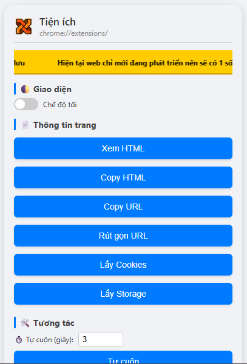

# 🔧 tool dev KHANHPC

**tool dev KHANHPC** là tiện ích Chrome hỗ trợ dev web với các công cụ tiện lợi giúp bạn thao tác nhanh chóng và hiệu quả trên trình duyệt.

## ✨ Tính năng nổi bật

- 📄 Xem và copy HTML, rút gọn URL, lấy cookies và storage  
- 🔍 Highlight phần tử, đếm từ, xoá modal phiền phức  
- 🛠️ Tự cuộn trang, chỉnh sửa trực tiếp, xoá toàn bộ CSS  
- 🌙 Giao diện hiện đại, hỗ trợ chế độ tối và có thể ghim popup  

## 🖼️ Giao diện tiện ích

  
*Ảnh minh họa popup tiện ích*

## 🚀 Cài đặt tiện ích

1. Clone repo hoặc tải mã nguồn về máy
2. Mở `chrome://extensions/` trên trình duyệt Chrome
3. Bật **Chế độ dành cho nhà phát triển**
4. Nhấn **Tải tiện ích đã giải nén** và chọn thư mục của dự án

---

💻 Phát triển bởi **KHANHPC**  
🛠 Mọi góp ý xin gửi tại [issues](https://github.com/HoangQuocKhanh0504/toolkhanhpc/issues)
